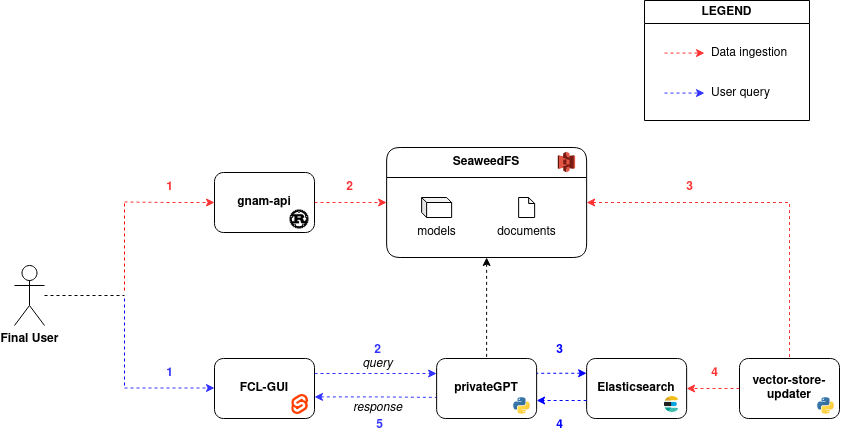

# full-deployment
Full deployment of the FCL-LM project to see if it works (locally for now)

Following, we show the scheme of the final cloud architecture of the project:


## Steps for the deploy in local with docker compose
Since the direct dependency on the models loaded into the seaweedfs of the privateGPT container, the process of getting up the application is divided in three steps

### First step
First run the services that do not depend directly on the data loaded in the seaweedfs to get them up and working
```bash
docker-compose up gnam-api elastic master volume filer s3 
```

check the health of the gnam-api after everything has finished the initialization:
```bash
curl -i http://localhost:9090/health
```
### Second step
Then create the _models_ bucket with the S3 API (minIO client, awscli, etc...) and load the models into the seaweedfs.

In the case of the minIO client (following the s3-config file shared here), the command to set the credentials is the following 
```bash
mc alias set seaweedfs http://localhost:8333 adminadmin adminadmin
```

To create the bucket run
```bash
mc mb seaweedfs/models
```

And to copy the model weights into the bucket run
```bash
mc cp /path/to/local/modelfile.bin seaweedfs/models/model.bin
```

Control if the models were loaded with 
```bash
mc ls /path/to/local/modelfile.bin seaweedfs/models/model.bin
```

remember to always have at least one file ingested with gnam-api since the application will not work otherwise.
```bash 
curl -i -F file=@/path/to/file http://localhost:9090/gnam
```

### Third step
```bash
docker compose up privategpt vector-store-updater web-gui
```

To connect to the application go to http://localhost:3000

## Deploy in kubernetes
To deploy to kubernetes, the requirements are a k8s cluster where to deploy the application and _kubectl_ working and connected to the cluster.

To deploy the application to the cluster, run:
```bash
cd k8s-deployment
chmod +x apply-configuration.sh 
./apply-configuration.sh
```

### Configure seaweedfs with minio client
Done as in [Second step](https://github.com/FCL-LM/full-deployment/tree/main#second-step)
### copy models to seaweedfs with minio client
```bash
mc cp /path/to/model seaweedfs/models/
```

```bash
mc cp /path/to/source seaweedfs/sources/
```
TODO automization

Deploy the rest of the apps with
```bash
chmod +x apply-private-and-gnam.sh 
./apply-private-and-gnam.sh
```

To get the public IP for the load balancer use
```bash
kubectl describe service privategpt-loadbalancer-service
```
or with minikube
```bash
minikube service privategpt-loadbalancer-service --url
```
Take the Load Balancer IP and substitute it in the web-gui-deployment.yaml file in the environment variable PUBLIC_FLASK_ENDPOINT. And redeploy only the web-gui with
```bash 
kubectl apply -f web-gui-deployment.yaml
```

 or the whole application with the previous command (only the modified deployment will be redeployed)
```bash 
./apply-configuration.sh
```

Then go to the web-gui IP (get it with *kubectl*) at the port 30000 and ask what you want to ask.

If you want to add more source documents remember to ingest the documents with:
```bash 
curl -i -F file=@/path/to/file http://<gnam-apiIP>:30090/gnam
```
